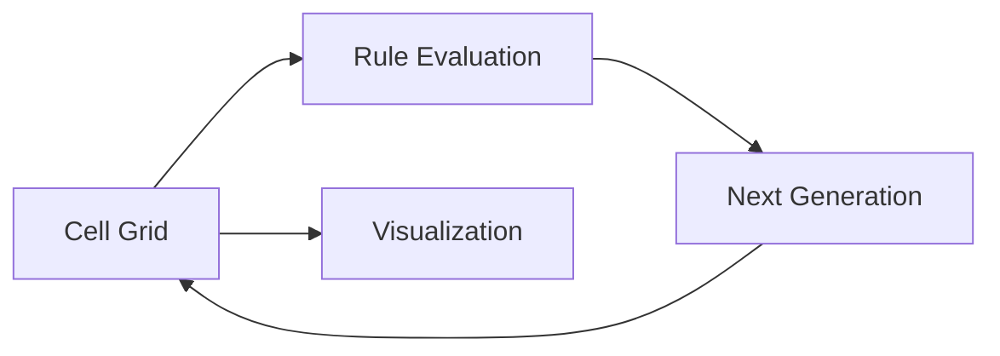

# Conway’s Game of Life — Cellular Automaton Simulation (Java)

**Conway’s Game of Life** is a visual simulation of the classic **cellular automaton** proposed by mathematician John Conway.

This project implements the full rule-based system from scratch in **Java**, focusing on **algorithmic clarity, state transitions, and visualization of emergent behavior**.

Rather than using external engines, the simulation is built around explicit grid updates and deterministic rules.

---

## What This Project Is About

This project demonstrates a **classic computational model** where complex behavior emerges from simple rules.

It shows how to:
- model discrete grid-based systems
- implement deterministic state transitions
- visualize evolving systems over time
- separate simulation logic from rendering
- manage performance in iterative algorithms

The same principles apply to:
- simulation engines
- agent-based models
- distributed systems modeling
- game mechanics and AI foundations

---

## Core Rules (Conway’s Original Model)

For each cell in the grid:

- Any live cell with fewer than two live neighbors dies (underpopulation)
- Any live cell with two or three live neighbors survives
- Any live cell with more than three live neighbors dies (overpopulation)
- Any dead cell with exactly three live neighbors becomes alive (reproduction)

Despite their simplicity, these rules generate complex and unpredictable patterns.

---

## High-Level Architecture



**Design principle:**  
State transitions are deterministic; complexity emerges from iteration.

---

## Project Structure

```
src/
  ConwaysGameOfLife.java   Core simulation logic and rendering
  images/                 UI assets
build.xml                 Build configuration
dist/                     Compiled artifacts
```

---

## Technology Stack

- **Java**
- **Swing / AWT** (UI & rendering)
- **Ant** (build system)
- **Grid-based simulation logic**

---

## Running the Project

### Option 1: Run compiled version
- Navigate to `dist/`
- Execute the provided JAR file

### Option 2: Build from source
```bash
ant build
ant run
```

Or open the project in a Java IDE and run `ConwaysGameOfLife.java`.

---

## Design Principles

- Deterministic rule evaluation
- Explicit state representation
- Separation of simulation and rendering
- Iterative update loop

---

## What This Project Demonstrates

- Cellular automata fundamentals
- Algorithmic problem solving
- Simulation and state modeling
- Visualizing emergent systems
- Clean Java application structure

---

## Final Notes

Conway’s Game of Life is a foundational model in computer science.

This project serves as:
- a strong demonstration of algorithmic thinking
- a basis for more advanced simulations
- a bridge between math, logic, and visual computation
